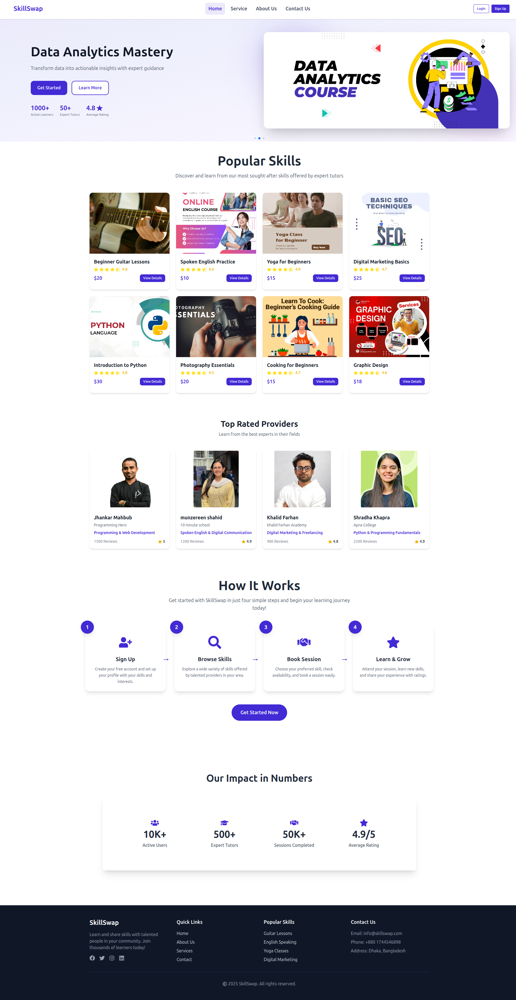

# SkillSwap - Local Skill Exchange Platform

## 🎯 Project Purpose
SkillSwap is an interactive platform for individuals to offer, learn, and trade skills within their local area. Whether it's guitar lessons, language exchange, coding help, or yoga training — users can browse listings, rate experiences, and connect with local skill providers.

## 🌐 Live URL
[SkillSwap Live Site](https://skillswap-d2870.web.app/)

## ✨ Key Features

### 🏠 Home Page
- **Hero Slider**: Interactive banner with Swiper.js integration
- **Popular Skills**: Browse available skills with ratings and pricing
- **Top Rated Providers**: Showcase of highly-rated skill instructors
- **How It Works**: Step-by-step guide for new users
- **Overall Ratings**: Platform statistics and user feedback


### 🔐 Authentication System
- **User Registration**: Complete signup with email/password validation
- **Secure Login**: Email/password and Google authentication
- **Password Requirements**: Uppercase, lowercase, minimum 6 characters
- **Forgot Password**: Password reset functionality with email redirect
- **Password Toggle**: Show/hide password with eye icon

### 📚 Skill Management
- **Skill Listings**: Browse 8+ available skills across categories
- **Detailed View**: Protected skill detail pages with full information
- **Book Sessions**: Interactive booking form for skill sessions
- **Categories**: Music, Language, Technology, Fitness, and more

### 👤 User Profile
- **Profile Dashboard**: View personal information and avatar
- **Update Profile**: Modify name and profile picture
- **Responsive Design**: Optimized for mobile, tablet, and desktop

### 🛡️ Security Features
- **Protected Routes**: Authentication required for sensitive pages
- **Environment Variables**: Secure Firebase configuration
- **Route Guards**: Automatic login redirection for protected content

## 🛠️ NPM Packages Used

### Core Dependencies
```json
{
  "react": "^18.3.1",
  "react-dom": "^18.3.1",
  "react-router-dom": "^6.28.0"
}
```

### UI & Styling
- **tailwindcss**: Utility-first CSS framework
- **daisyui**: Tailwind CSS component library
- **react-icons**: Popular icon library (Fa icons)

### Animation & Effects
- **framer-motion**: Production-ready motion library for React
- **swiper**: Modern mobile touch slider

### Notifications & Feedback
- **react-hot-toast**: Smoking hot React notifications

### Firebase Integration
- **firebase**: Backend-as-a-Service platform
  - Authentication (Email/Password, Google)
  - Hosting and deployment

### Development Tools
- **vite**: Next generation frontend tooling
- **eslint**: JavaScript linting utility
- **@vitejs/plugin-react**: Official Vite React plugin

## 🚀 Getting Started

### Prerequisites
- Node.js (v14 or higher)
- npm or yarn package manager

### Installation
1. Clone the repository
```bash
git clone https://github.com/your-username/skillswap.git
cd skillswap
```

2. Install dependencies
```bash
npm install
```

3. Create environment variables
```bash
# Create .env file with your Firebase configuration
VITE_FIREBASE_API_KEY=your_api_key
VITE_FIREBASE_AUTH_DOMAIN=your_auth_domain
VITE_FIREBASE_PROJECT_ID=your_project_id
VITE_FIREBASE_STORAGE_BUCKET=your_storage_bucket
VITE_FIREBASE_MESSAGING_SENDER_ID=your_sender_id
VITE_FIREBASE_APP_ID=your_app_id
```

4. Run the development server
```bash
npm run dev
```

## 📱 Responsive Design
- **Mobile First**: Optimized for mobile devices
- **Tablet Support**: Enhanced tablet viewing experience
- **Desktop Layout**: Full-featured desktop interface
- **Cross-Browser**: Compatible with modern browsers

## 🔧 Build & Deployment
```bash
# Build for production
npm run build

# Preview production build
npm run preview
```
---
**Made By 0xzahed**